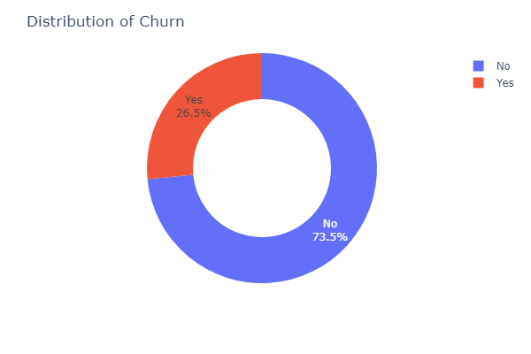
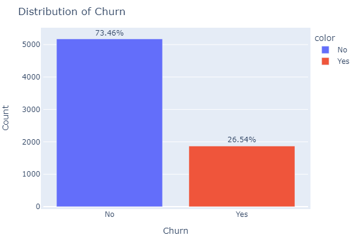
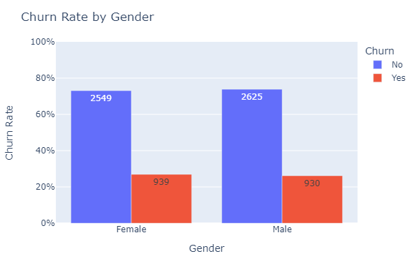
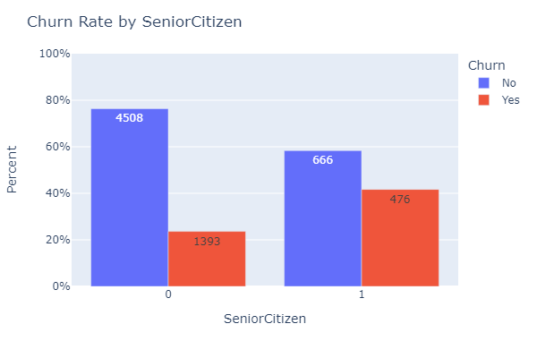
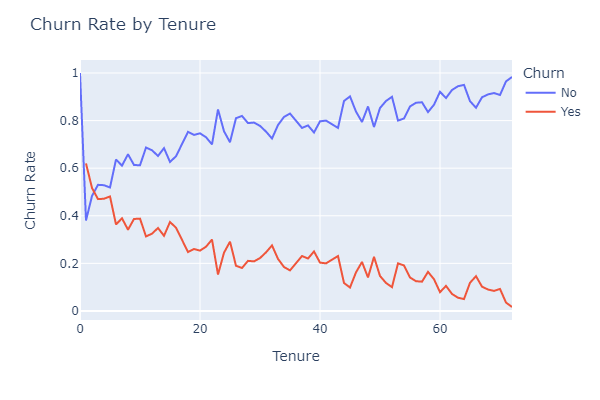
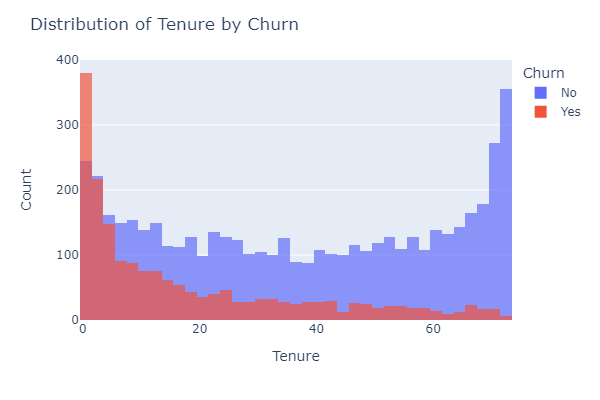
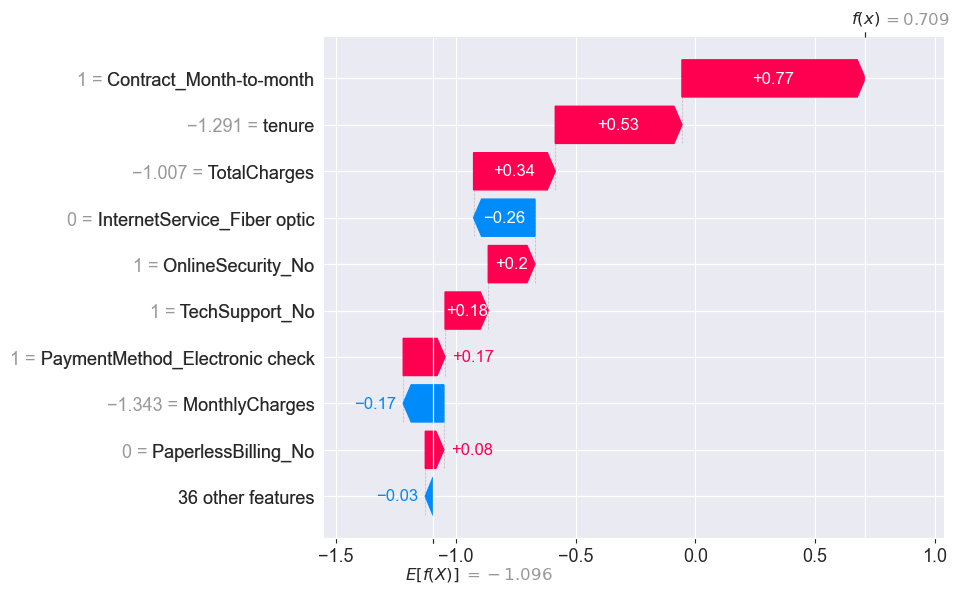
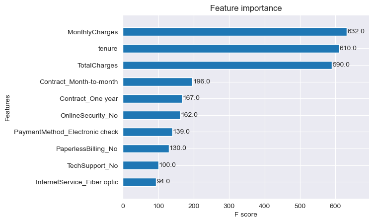
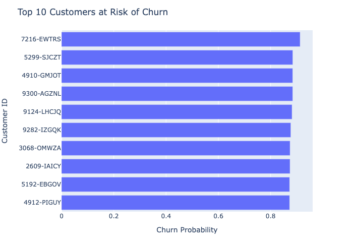

## Telecom Churn Analysis
This repository contains the code for analyzing telecom churn rate. The aim of this project is to predict whether a customer will churn or not based on various features.

[Link to Tableau Dashboard](https://public.tableau.com/views/ChurnDashboard_16836452983320/ChurnDashboard?:language=en-US&publish=yes&:display_count=n&:origin=viz_share_link)

[View on Google Colab](https://colab.research.google.com/drive/1KHAz6vBfsyrZ6AQDs5YovIRazEb27eK6?usp=sharing)

## Table of Contents
* Libraries Used
* Load Data
* Exploratory Data Analysis
* Data Preprocessing
* Machine Learning
## Libraries Used
* pandas
* numpy
* seaborn
* matplotlib
* plotly
* shap
* scikit-learn
* xgboost

## Load Data
The dataset used for this project is the Telco-Customer-Churn.csv file. This dataset was source from kaggle: https://www.kaggle.com/blastchar/telco-customer-churn. It contains information about customers who have either churned or not churned. The dataset includes features such as customer demographics, account information, and services that each customer has signed up for.

## Exploratory Data Analysis
The following tasks were performed in the exploratory data analysis:

* Checked for data types and null values.
* Converted TotalCharges to float and filled in missing values.
* Obtained descriptive statistics.
* Dropped the customerID column.
* Plotted churn rate distribution.

27.5% or 1869 customers have churned while 73.5% or 5174 customers have not chured. This is about a 1:2.77 churn to not churn ratio indicating that for every one customer who churned, there are 2.77 customers who did not churn.
* Calculated churn percentage.

* Grouped the data by gender and churn and counted the number of customers in each group.

* Calculated the churn rate for each gender and created a bar chart.

* Created a function to plot the churn rate by different categories such as PaymentMethod, Partner, Dependents, etc.

* Calculated the churn rate by tenure and created a line and histogram chart

As Tenure (time with company) increases the churn rate declines.  

The majority of customers who have churned have significantly lower tenure than those who have not churned

## Data Preprocessing
The following tasks were performed in the data preprocessing:

Dropped the customerID column.
Converted TotalCharges to float and filled in missing values.
Encoded the target variable Churn to numerical values.
Split the data into train, validation, and test sets.
Preprocessed the data using a preprocessing function that performs one-hot encoding for categorical features and standardization for numerical features.

## Machine Learning

### Model Training and Experimentation

#### Lazy Predict

First, LazyClassifier from the lazypredict package is used to quickly train and test multiple machine learning models with default hyperparameters on the preprocessed training data. 

#### Hyperparameter Tuning

After identifying some of the top-performing models, I performed hyperparameter tuning on SVC, RidgeClassifierCV, Logistic Regression, AdaBoost and XGBoost using  GridSearchCV 

After finding the best hyperparameters for each model, I trained the models again using these hyperparameters, and then evaluated their performance on the validation set using various metrics such as accuracy, precision, recall, F1-score and ROC AUC score.

## Results
The best performing model was XGBoost with an accuracy of 81.92%, precision of 67.12%, recall of 52.05%, F1-score of 58.61%, and ROC-AUC of 0.816.

SHAP analysis was performed to interpret the XGBoost model. The analysis revealed that the most important features in predicting churn were MonthlyCharges, Contract_month-to-month, Tenure, and InternetService_Fiber optic.

#### Feature Importances

From our plot_importances results we can see that are top three most important features are MonthlyCharges, tenure, and TotalCharges. Each of the features has an F Score about 3x greater than the 4th ranked feaured Contract_Month-to-Month

## Churn Probability List

In addition to predicting whether a customer will churn or not, we can also calculate the probability of churn for each customer. This can be useful for identifying customers who are at a high risk of churning and can be targeted with retention strategies.

To do this, we first save the best model using joblib. We then load the saved model and use it to predict the probabilities of churn on the test set. We store the results in a new dataframe that includes the customer ID, the original features, and the predicted churn probabilities. This dataframe can then be used to generate a list of customers sorted by their probability of churn.

### Top 10 Customers at risk of Churn

## Conclusion
In this project, we analyzed the telecom churn rate using various machine learning algorithms. The best performing model was XGBoost with an accuracy of 81.92%. We also performed SHAP analysis to interpret the XGBoost model and found that MonthlyCharges, Tenure, and InternetService_Fiber optic were the most important features in predicting churn.

Created a machine learning model to predict customer churn based on various features.
Conducted exploratory data analysis and data preprocessing using pandas, numpy, seaborn, matplotlib, and plotly.
Achieved an accuracy of [insert accuracy result here] by training and testing multiple machine learning models using LazyClassifier and hyperparameter tuning with GridSearchCV. Also, created a list of customers based on their risk of churn probability.
